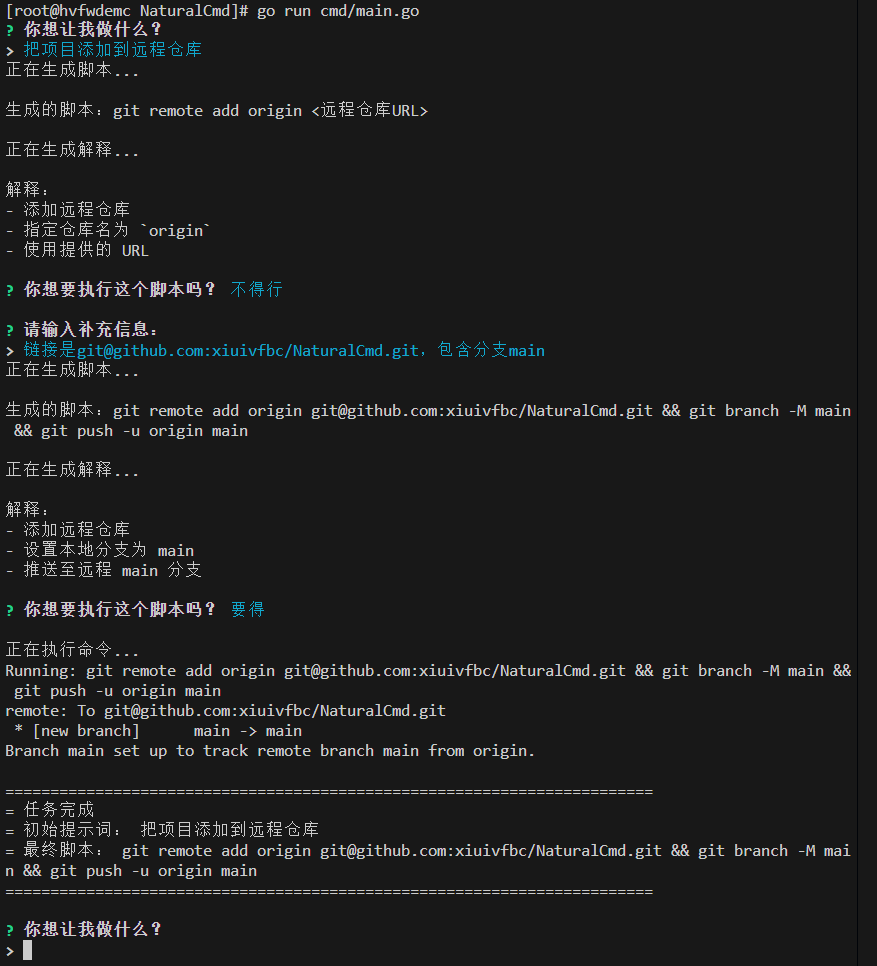

# NaturalCmd

一个用 Go 实现的 Cmd，将自然语言转换为 Cmd 命令的命令行工具。

## 功能

- 将自然语言转换为 Cmd 命令
- 自动执行生成的命令
- 为生成的命令提供解释
- 跨平台支持
- 流式响应，提供更好的用户体验
- 环境感知能力，能够获取当前目录文件状态
- 智能错误处理，执行失败时会自动重新生成脚本
- 支持多语言输出（中文/英文）
- 支持不同的 AI 模型提供商（OpenAI、阿里云）

## 示例
亲测有效：

## 安装

### 前提条件

- Go 1.20 或更高版本
- AI 模型 API 密钥（OpenAI 或阿里云）

### 构建

```bash
go build -o ai ./cmd/ai
```

## 使用

### 设置 API 密钥

#### 使用 .env 文件（推荐）

在项目根目录下创建一个 `.env` 文件，添加以下内容：

```env
# API 密钥
API_KEY=your-aliyun-api-key

# API 端点
API_ENDPOINT=https://ark.cn-beijing.volces.com/api/v3/chat/completions

# 使用的模型
MODEL=ep-20240311175046-xqxz6

# 模型提供商（openai 或 aliyun）
PROVIDER=aliyun

# 解释的语言
LANGUAGE=zh

# 启用静默模式
SILENT_MODE=false

# 启用轻量 RAG（基于历史命令检索增强）
RAG_ENABLED=true

# RAG 检索条数
RAG_TOP_K=3

# RAG 反馈权重文件路径（可选）
RAG_FEEDBACK_FILE=

# 开启模型语义扩展（本地检索未命中时触发）
RAG_SEMANTIC_EXPAND=true
```

#### 使用环境变量

```bash
# Linux/macOS
export API_KEY=your-api-key

# Windows
set API_KEY=your-api-key
```

### 运行

```bash
# 带参数运行
./ai "列出当前目录中的所有文件"

# 使用 p 标志
./ai -p "查找所有 .go 文件"

# 按关键词搜索历史记录
./ai -h "git push"

# 查看全部历史记录（不带值）
./ai -h

# 组合短参数示例
./ai -hs
./ai -ps "查找所有 .go 文件"

# 交互式模式（不带参数）
./ai
```

### 标志

- `-p`: 直接指定提示
- `-h`: 按关键词搜索历史记录；当不带值时等价于查看全部历史
- `-s`: 不生成命令解释

## 配置

该工具使用以下环境变量进行配置：

| 环境变量 | 描述 | 默认值 |
|----------|------|--------|
| `API_KEY` | 您的 API 密钥（必填） | |
| `API_ENDPOINT` | API 端点 | `https://ark.cn-beijing.volces.com/api/v3/chat/completions` |
| `MODEL` | 使用的模型 | `ep-20240311175046-xqxz6` |
| `PROVIDER` | 模型提供商（`openai` 或 `aliyun`） | `aliyun` |
| `LANGUAGE` | 解释的语言 | `zh` |
| `SILENT_MODE` | 启用静默模式 | `false` |
| `RAG_ENABLED` | 是否启用基于历史记录的 RAG 增强 | `true` |
| `RAG_TOP_K` | RAG 检索返回的历史条数 | `3` |
| `RAG_FEEDBACK_FILE` | RAG 成功/失败反馈权重文件路径（为空则使用默认路径） | `` |
| `RAG_SEMANTIC_EXPAND` | 本地检索未命中时是否调用模型做语义扩展 | `true` |

## 工作原理

1. **用户输入**：用户输入自然语言描述的任务
2. **环境感知**：工具获取当前目录的文件和目录状态
3. **AI 处理**：将用户输入和环境信息发送给 AI 模型
4. **响应解析**：解析聊天补全响应（支持流式 SSE），实时拼接 `choices[].delta.content`（兼容 `message.content` / `output.text`），并提取最终单行命令。
5. **交互执行**：展示生成命令，用户可选择执行、继续调整（补充信息后重生成）或取消。
6. **失败闭环**：若命令执行失败，自动将错误信息、退出码和输出回灌给模型，重新生成更可靠的命令。